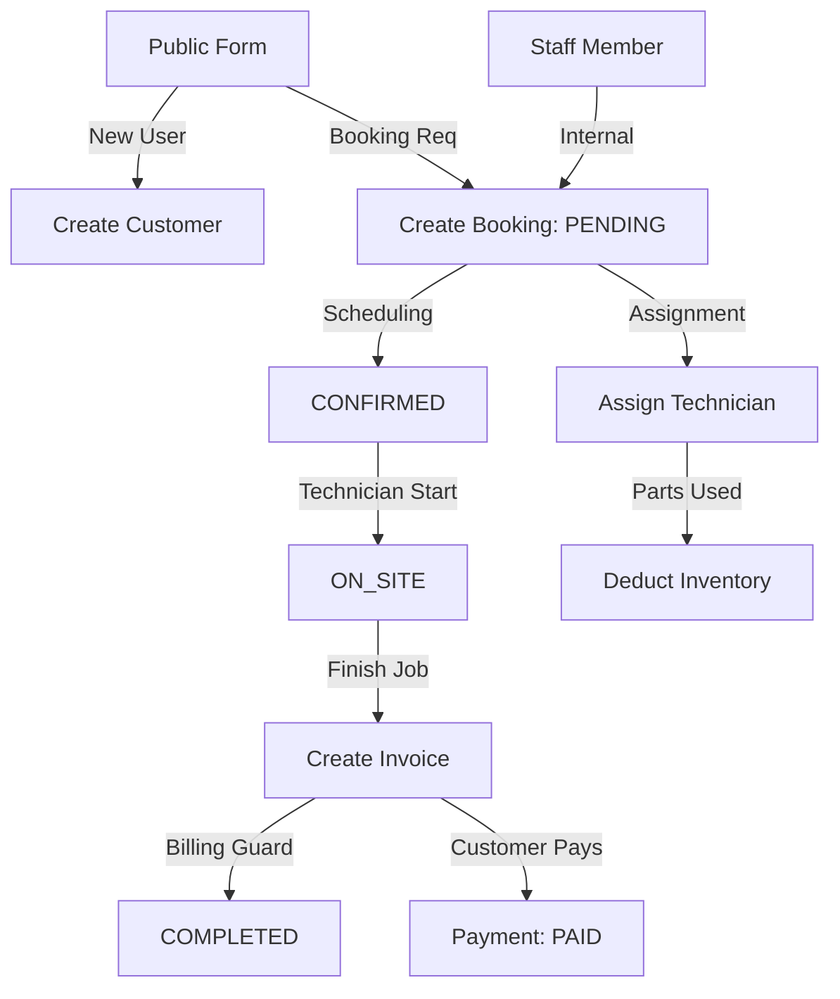

# Aircon Service Manager: System Architecture & Process Overview

This document provides a complete overview of the current system processes, from booking creation to inventory management and financial reporting.

---

## 🏗️ Core Architecture: Multi-Tenancy

The system is designed as a **Multi-Tenant** application.
- **Organization**: The top-level entity (e.g., an Aircon Service Company). Data is strictly isolated by `organizationId`.
- **Branch**: An organization can have multiple branches (e.g., "North Branch", "South Branch").
- **Users**:
  - `ADMIN`: Has full access to all branches within their organization.
  - `BRANCH_LEADER`: Access is restricted to their assigned branch.

---

## 📅 The Booking Workflow

The booking process focused on streamlined customer discovery and flexible assignment.

### 1. Customer Discovery (Search or Create)
- **Action**: Staff starts by searching for a Customer by **Name** or **Phone**.
- **Existing**: If found, details (Name, Phone, Address) are auto-filled.
- **New**: If not found, a new customer record is created inline with fields: Name, Phone, and Address.
- **Goal**: Every booking is linked to a unique `Customer ID` for history tracking.

### 2. Booking Details (The Job)
- **Schedule**: Date of service selected via calendar.
- **Service Type**: Selected from a dropdown: `Cleaning`, `Repair`, or `Maintenance`.
- **Branch**: 
  - Admins can select any branch.
  - Branch Leaders are auto-filled and locked to their specific branch.
- **Status**: Default state is `PENDING`.

### 3. Assignment (Flexible Scheduling)
- **Default**: "Assign Later".
- **Logic**: Bookings can be saved without a Technician.
- **Management**: Admins/Leaders can visit a "Pending Dispatch" list later to assign a specific Technician once availability is confirmed.

---

## 💰 Financials & Invoicing

### 1. Invoice Generation
- An `Invoice` must be created for a `Booking` before it can be marked as `COMPLETED`.
- Currently, an invoice tracks a single `amount`, `paymentStatus` (`UNPAID`, `PARTIAL`, `PAID`), and `paymentMethod`.

### 2. Payment Tracking
- Invoices are initially `UNPAID`.
- When updated to `PAID`, the system records the `paidAt` timestamp.
- Financial reports aggregate these amounts to show revenue by branch or organization.

---

## 📦 Inventory Management

The system tracks supplies and parts (e.g., Freon, Copper Pipes) at the branch level.

### 1. Inventory Items
- Linked to a `Branch`.
- Tracks `quantity`, `unitCost`, and `SKU`.

### 2. Transactions
- Every movement of stock is logged as an `InventoryTransaction`.
- **Stock In**: Manual adjustment or restock.
- **Stock Out**: Linked to a `Booking` when a technician uses parts on a job.
- **Guard**: Inventory cannot go below zero.

---

## 👥 Customer Management
- Customers are owned by the `Organization`.
- Tracks `name`, `phone`, and `address`.
- A customer's service history is viewed by listing all their `Bookings`.

---

## 📊 Reporting & Analytics
- **Dashboard**: High-level view of today's schedule and pending tasks.
- **Reports**: Detailed breakdown of bookings and revenue, filtered by date and branch.

---

## 🔄 System Flowchart (Mermaid)

